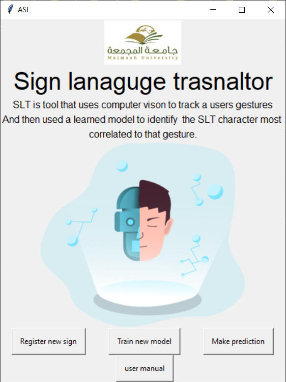
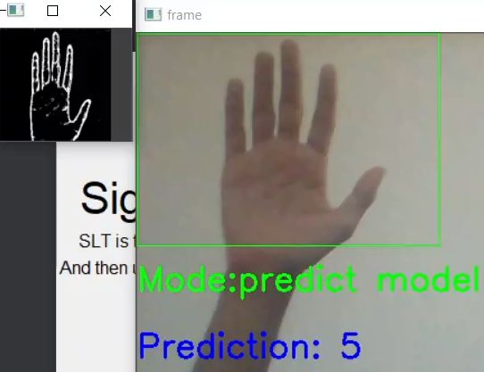
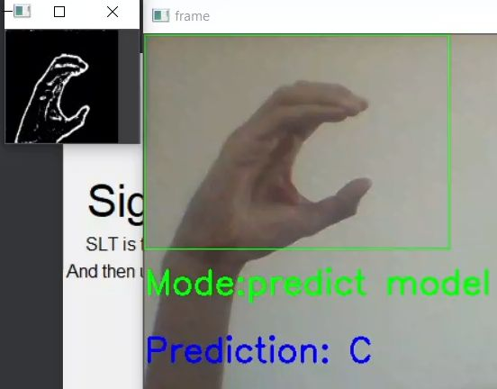

# Sign-Language-Translator
Real-Time Sign Language Translation using Computer Vision and Convolutional neural network

## Screenshot




## Technology Used in Project 

* Python3
* OpenCV
* Keras
* Tensorflow
* CNN image classification 
* Python tkinter

## Requirements
* Python3
* opencv package
* tensorflow package
* Webcam


## Set up instructions

Clone the project using git clone

```bash
git clone https://github.com/moayadalsariya/Sign-Language-Translator
```
Then cd to Sign-Language-Translator

```bash
cd Sign-Language-Translator
```
Use the package manager [pip](https://pip.pypa.io/en/stable/) to install requirements dependency

```bash
pip install tensorflow
pip install opencv-contrib-python
pip install pillow
```
Run the program

```bash
python ./ASL.py
```


## How to use the program

### First register new sign

* After your run the program using python ASL.py, click 'Register new sign' button to register sign
* new window will appear, enter sign the you want to register in filed and press submit
* Camera windows will appear, now place your hand into green area in press 'space' key in your keyboard to caputre the images (100 image require)
* After your register your sign, close the webcam window by pressing 'esc' key in your keyboard.
* if you like to register new sign do the the steps again, press register button ... etc
* make sure there are white background before you capture the images

### Train the model
* After collecting images, now start train model by pressing train new model in your keybaord.
* after train is completed new save file windows will appear to save your traind model, so you don't need to train model every time
* make sure the file extension of save model is .h5 

### Predict model
* After train model, you can make prediction by pressing make prediction button.
* New window will apear asking for to select the your pre-train model.
* Now Camera windows will appear, your start make prediction by placing your hand into green area

## Contributing
Pull requests are welcome. For major changes, please open an issue first to discuss what you would like to change.

Please make sure to update tests as appropriate.

## License
[MIT](https://choosealicense.com/licenses/mit/)
